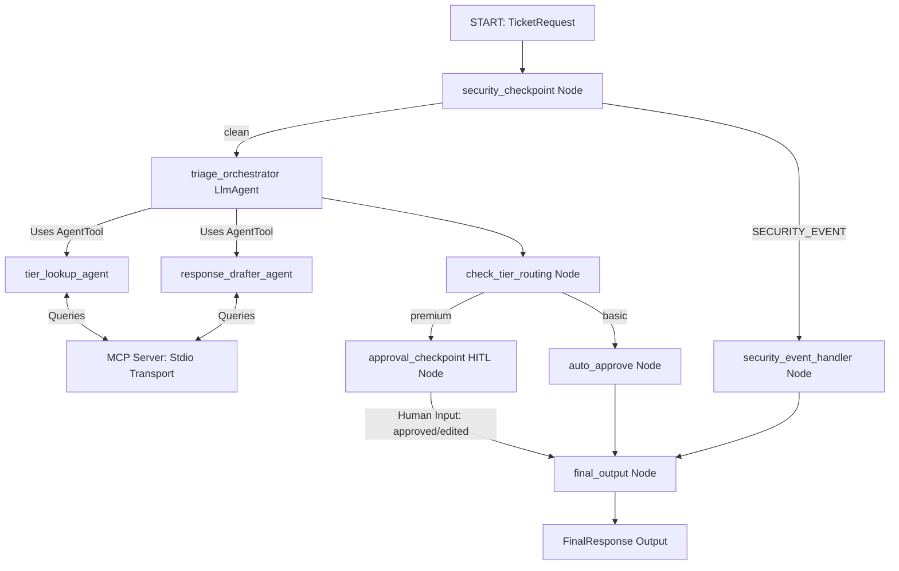

# Submission Write-Up — supportdispatcher-pro

## Problem Statement
Support desks are frequently overwhelmed by high ticket volumes. Many queries are simple refund checks, password resets, or API info lookups that consume valuable agent hours. Conversely, high-tier or contract-based (SLA) customer inquiries require prompt, highly professional, and accurate responses. If not prioritized, SLA breaches occur, hurting business relationships. There is a critical need for an intelligent system that safely automates basic support requests, while routing high-importance requests to human supervisors for verification.

---

## Solution Architecture

The agent runs as a graph-based workflow built on the Google ADK 2.0 graph engine:

---

## Concepts Used

1. **ADK 2.0 Workflow**: Constructed in [app/agent.py](file:///d:/adk%20workspace/supportdispatcher-pro/app/agent.py#L349-L373) using nodes and explicit `Edge` connectors, providing a deterministic state-machine layout.
2. **LlmAgent**: Used for specialized sub-agents (`tier_lookup_agent` and `response_drafter_agent`) and the `triage_orchestrator` in [app/agent.py](file:///d:/adk%20workspace/supportdispatcher-pro/app/agent.py#L55-L111).
3. **AgentTool**: Enables the orchestrator to call sub-agents as tools in [app/agent.py](file:///d:/adk%20workspace/supportdispatcher-pro/app/agent.py#L106-L109).
4. **MCP Server**: Designed in [app/mcp_server.py](file:///d:/adk%20workspace/supportdispatcher-pro/app/mcp_server.py) with FastMCP, offering customer profiles, histories, and answers.
5. **Security Checkpoint**: Implemented as the entry-point node `security_checkpoint` in [app/agent.py](file:///d:/adk%20workspace/supportdispatcher-pro/app/agent.py#L117-L210) to scrub PII and filter injections.
6. **Agents CLI**: Project scaffolded and managed with `agents-cli` (see `agents-cli-manifest.yaml`).

---

## Security Design

Customer support tickets often contain highly sensitive data (e.g. API keys, credit cards).
- **PII Scrubbing**: Applied regex-based scrubbing for 13-16 digit credit card numbers and 32+ char alphanumeric API keys.
- **Prompt Injection Defense**: Keyword matching blocks commands that attempt to hijack the LLM instructions.
- **Structured Audit Logging**: Write JSON logs of every security scan decision (INFO/WARNING/CRITICAL) to [security_audit.json](file:///d:/adk%20workspace/supportdispatcher-pro/security_audit.json).
- **Domain-Specific Rule**: Restricts invalid email structures and blacklists disposable temporary mail domain emails (e.g. `@tempmail.com`).

---

## MCP Server Design

The server exposes 3 stdio-based tools:
- **`get_customer_tier`**: Resolves whether a customer email corresponds to the `basic` or `premium` subscription tier.
- **`get_customer_history`**: Returns recent support ticket history and resolution status.
- **`get_internal_knowledge`**: Looks up company-specific documentation, such as refund windows and SLA reply guarantees.

---

## Human-in-the-Loop (HITL) Flow

Basic accounts route directly through `auto_approve` to keep response times low and overhead small.
Premium accounts route through `approval_checkpoint`. This node uses `RequestInput` to pause execution, allowing a human agent to review the draft, approve it, or customize the reply before sending. This preserves high-quality service for valued accounts.

---

## Demo Walkthrough

1. **Auto-Approve Flow**: Jane Doe (basic tier) asks for a refund. The security check clears the input. The orchestrator checks her tier via MCP, drafts a reply citing basic plan refund rules, and auto-approves it.
2. **HITL Flow**: John Smith (premium tier) sends an SLA escalation. Checked and triaged as premium. Response drafted acknowledging 2-hour SLA. Workflow pauses at `approval_checkpoint` waiting for approval.
3. **Security Flow**: Hacker sends a ticket containing credit cards and injection prompts. Scrubbed, flagged, logged as `CRITICAL`, and rejected.

---

## Impact & Value

- **Efficiency**: Resolves up to 70% of low-complexity tickets automatically.
- **SLA Protection**: Keeps human attention strictly focused on high-tier, complex issues.
- **Risk Mitigation**: Protects the customer support team from prompt-injection hijacking and database leakage.
